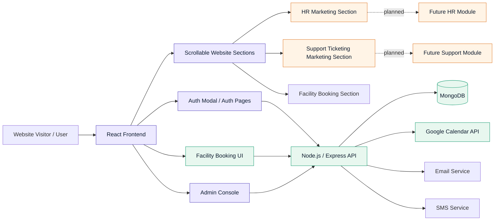
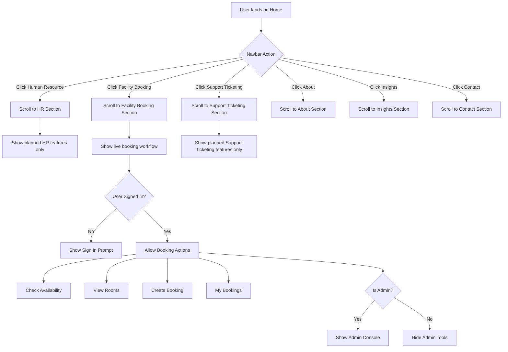
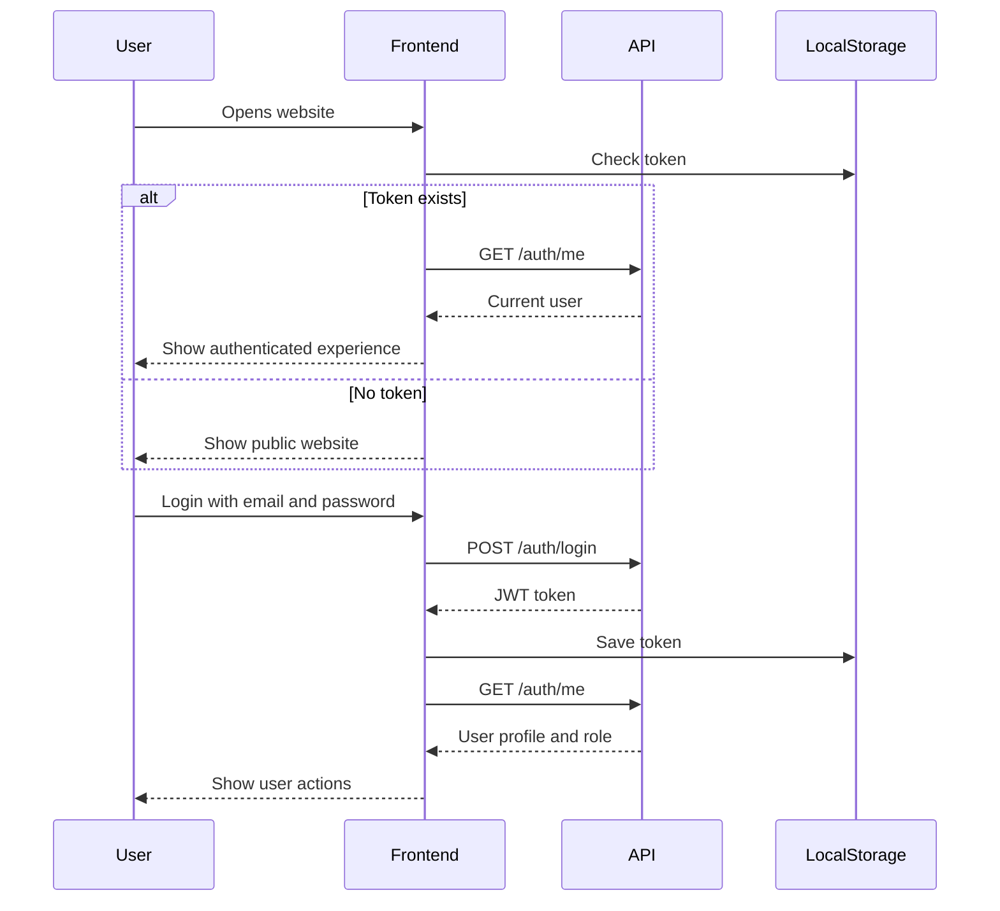
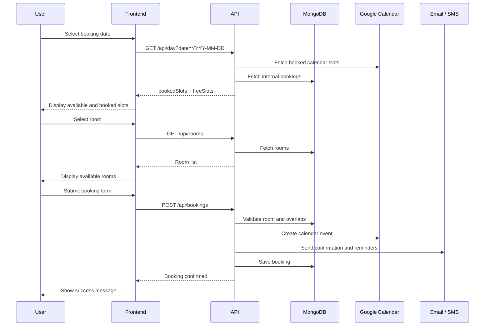
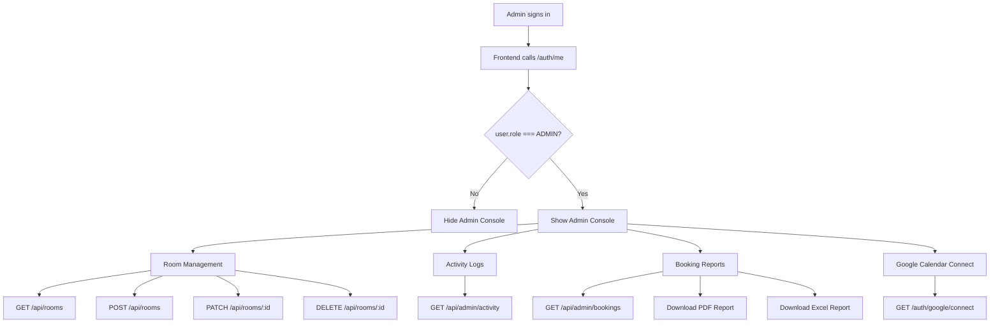
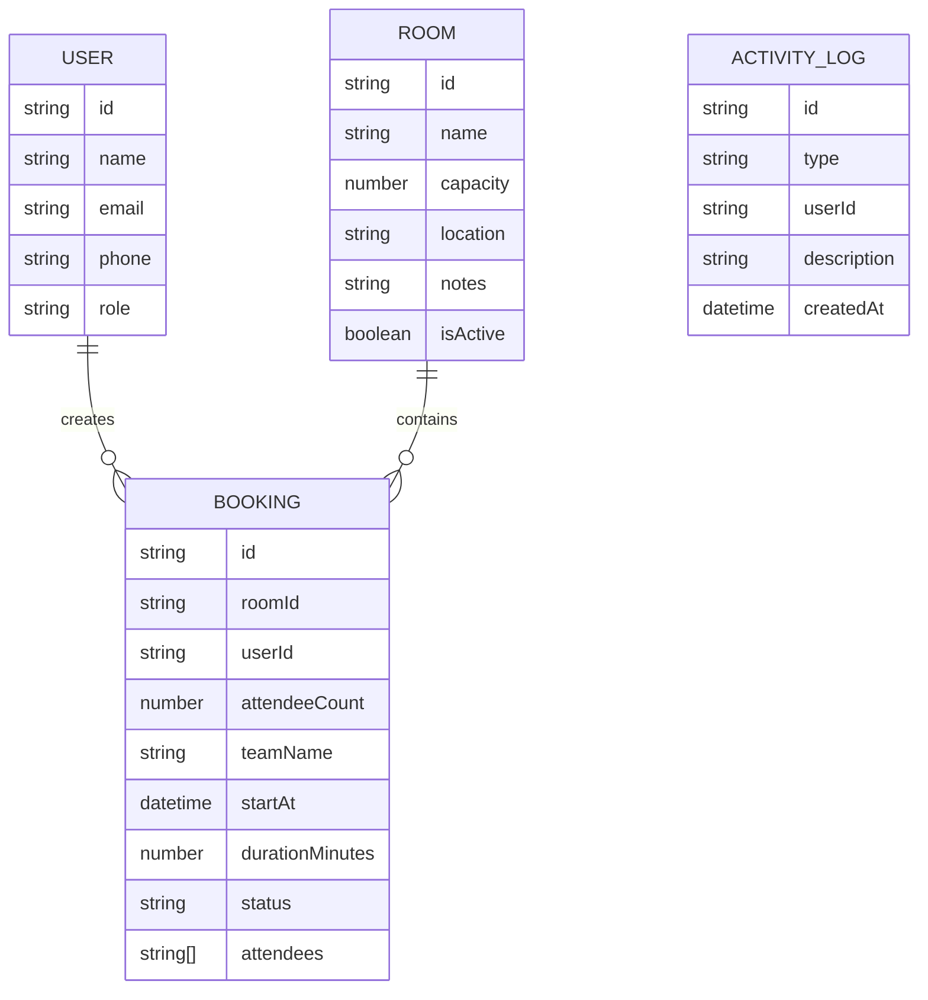
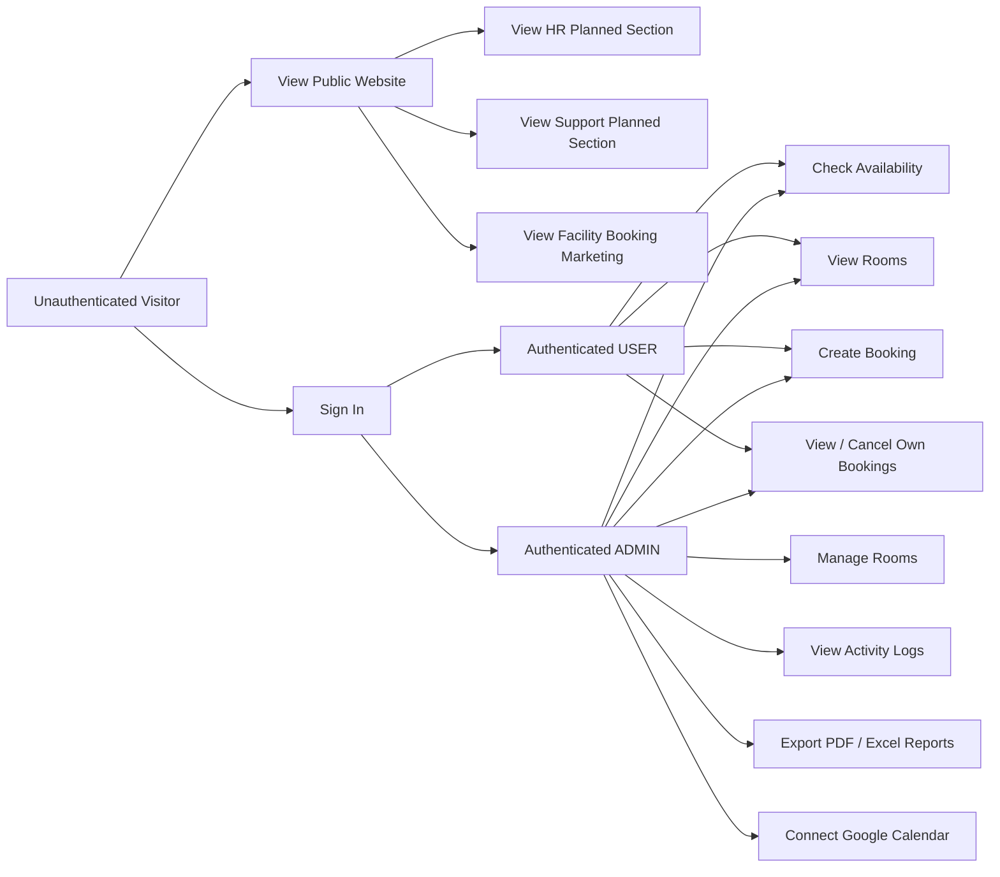
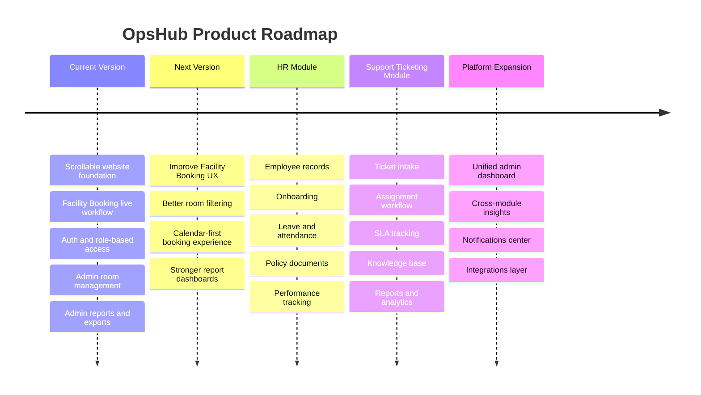
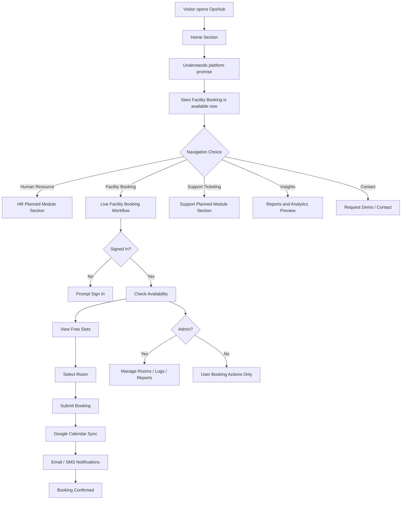

# OpsHub — Workplace Operations Platform


OpsHub is a workplace operations platform designed to unify **Facility Booking**, **Human Resource**, and **Support Ticketing** into one clean enterprise system.

The current version focuses on a fully working **Facility Booking / Boardroom Booking** workflow, while **Human Resource** and **Support Ticketing** are presented as planned modules for upcoming versions.

---

## Table of Contents

- [Project Overview](#project-overview)
- [Module Status](#module-status)
- [Core Features](#core-features)
- [System Architecture](#system-architecture)
- [Frontend Page Flow](#frontend-page-flow)
- [Authentication Flow](#authentication-flow)
- [Facility Booking Flow](#facility-booking-flow)
- [Admin Flow](#admin-flow)
- [Data Model Overview](#data-model-overview)
- [API Reference](#api-reference)
- [Environment Variables](#environment-variables)
- [Local Setup](#local-setup)
- [Recommended Folder Structure](#recommended-folder-structure)
- [Role-Based Access](#role-based-access)
- [Current Scope vs Planned Scope](#current-scope-vs-planned-scope)
- [Development Notes](#development-notes)

---

## Project Overview

OpsHub is built as a scrollable product website with live system functionality embedded into the **Facility Booking** section.

The landing page is not just a static dashboard. It works as a proper product website with anchored navigation sections:

- Home
- Human Resource
- Facility Booking
- Support Ticketing
- About
- Insights
- Contact

The **Facility Booking** section connects to the existing backend workflow for checking availability, viewing rooms, creating bookings, viewing user bookings, cancelling bookings, and accessing admin reports.

---

## Module Status

| Module | Status | Description |
|---|---|---|
| Facility Booking | Available Now | Live boardroom/resource booking workflow connected to backend APIs |
| Human Resource | Planned Module | Advertised as an upcoming HR operations module |
| Support Ticketing | Planned Module | Advertised as an upcoming support/ticketing module |

---

## Core Features

### Available Now — Facility Booking

- User authentication with JWT
- Boardroom / resource availability checking
- Free slot detection
- Room listing
- Booking creation
- User booking history
- Booking cancellation
- Google Calendar sync through backend
- Email and SMS notifications through backend
- Admin room management
- Admin activity logs
- Admin PDF / Excel report exports

### Planned — Human Resource

- Employee records
- Onboarding workflows
- Leave and attendance
- Policy and document management
- Performance tracking
- HR analytics

### Planned — Support Ticketing

- Ticket intake
- Ticket assignment
- SLA tracking
- Escalation rules
- Knowledge base
- Reports and analytics

---

## System Architecture



---

## Frontend Page Flow

The frontend uses a scrollable single-page website structure. Navigation links scroll to page sections instead of opening empty routes for unfinished modules.



---

## Authentication Flow

Authentication uses JWT tokens stored on the frontend and sent in the `Authorization` header for protected API requests.



---

## Facility Booking Flow

This is the main live workflow in the current version.



---

## Admin Flow

Admins can manage rooms, view activity logs, export reports, and connect Google Calendar.



---

## Data Model Overview



---

## API Reference

### Authentication

| Method | Endpoint | Description |
|---|---|---|
| POST | `/auth/register` | Register a new user |
| POST | `/auth/login` | Login and receive JWT |
| GET | `/auth/me` | Get current authenticated user |
| GET | `/auth/google/connect` | Start Google Calendar OAuth flow |

Example login payload:

```json
{
  "email": "user@example.com",
  "password": "password"
}
```

---

### Facility Booking

| Method | Endpoint | Description |
|---|---|---|
| GET | `/api/day?date=YYYY-MM-DD` | Get booked and free slots for a date |
| POST | `/api/bookings` | Create a new booking |
| GET | `/api/bookings/mine` | List current user bookings |
| DELETE | `/api/bookings/:id` | Cancel a booking |

Example booking payload:

```json
{
  "roomId": "room_id_here",
  "attendeeCount": 4,
  "teamName": "Engineering Team",
  "startAt": "2026-05-21T10:00:00.000Z",
  "durationMinutes": 60,
  "attendees": [
    "person1@example.com",
    "person2@example.com"
  ]
}
```

---

### Rooms

| Method | Endpoint | Description |
|---|---|---|
| GET | `/api/rooms` | List rooms |
| POST | `/api/rooms` | Create room |
| PATCH | `/api/rooms/:id` | Update room |
| DELETE | `/api/rooms/:id` | Delete room |

Example room payload:

```json
{
  "name": "Boardroom A",
  "capacity": 12,
  "location": "Head Office",
  "notes": "Main executive meeting room"
}
```

---

### Admin & Reports

| Method | Endpoint | Description |
|---|---|---|
| GET | `/api/admin/bookings?from=ISO&to=ISO` | List all bookings in date range |
| GET | `/api/admin/activity?limit=50&skip=0` | View system activity logs |
| GET | `/api/admin/reports/bookings.pdf?from=ISO&to=ISO` | Download PDF report |
| GET | `/api/admin/reports/bookings.xlsx?from=ISO&to=ISO` | Download Excel report |

---

## Environment Variables

Create a `.env` file in the frontend root.

```env
VITE_API_URL=http://localhost:5000
```

If your backend runs on another port or domain, update `VITE_API_URL`.

Example:

```env
VITE_API_URL=https://api.yourdomain.com
```

---

## Local Setup

### 1. Clone the repository

```bash
git clone <your-repository-url>
cd <project-folder>
```

### 2. Install dependencies

```bash
npm install
```

### 3. Configure environment variables

Create `.env`:

```env
VITE_API_URL=http://localhost:5000
```

### 4. Start the development server

```bash
npm run dev
```

### 5. Open the frontend

```txt
http://localhost:5173
```

---

## Recommended Folder Structure

```txt
src/
├── components/
│   ├── layout/
│   │   ├── Navbar.tsx
│   │   └── Footer.tsx
│   └── ui/
│       ├── Button.tsx
│       ├── Card.tsx
│       └── Modal.tsx
│
├── sections/
│   ├── HomeSection.tsx
│   ├── HumanResourceSection.tsx
│   ├── FacilityBookingSection.tsx
│   ├── SupportTicketingSection.tsx
│   ├── AboutSection.tsx
│   ├── InsightsSection.tsx
│   └── ContactSection.tsx
│
├── features/
│   ├── auth/
│   │   ├── AuthModal.tsx
│   │   ├── LoginForm.tsx
│   │   └── RegisterForm.tsx
│   │
│   ├── facility/
│   │   ├── AvailabilityChecker.tsx
│   │   ├── RoomList.tsx
│   │   ├── BookingForm.tsx
│   │   └── MyBookings.tsx
│   │
│   └── admin/
│       ├── AdminConsole.tsx
│       ├── RoomManagement.tsx
│       ├── ActivityLogs.tsx
│       └── BookingReports.tsx
│
├── services/
│   ├── api.ts
│   ├── authApi.ts
│   ├── bookingApi.ts
│   ├── roomApi.ts
│   └── adminApi.ts
│
├── App.tsx
└── main.tsx
```

---

## Role-Based Access



---

## Current Scope vs Planned Scope

### Current Version

The current version is focused on delivering a strong frontend foundation and connecting the Facility Booking workflow.

Available now:

- Scrollable website layout
- Navigation anchors
- Facility Booking section
- Auth modal
- JWT session handling
- API client with bearer token support
- Availability checking
- Room listing
- Booking form
- My bookings
- Admin console visibility
- Admin room/report/log workflows

### Planned Versions

Upcoming modules:

- Human Resource
- Support Ticketing

These sections currently exist as marketing sections only and should not pretend to be fully functional until backend modules are implemented.

---

## Development Notes

### Token Handling

The frontend stores the JWT token in local storage using:

```js
localStorage.getItem("token")
```

All protected API requests should include:

```js
Authorization: Bearer <token>
```

---

### Date Handling

Availability checks use:

```txt
YYYY-MM-DD
```

Booking submissions use ISO 8601:

```txt
2026-05-21T10:00:00.000Z
```

---

### Error Handling

Backend errors should be displayed clearly to the user.

Expected backend error shape:

```json
{
  "ok": false,
  "message": "Reason for failure"
}
```

Examples of user-facing errors:

```txt
Unable to load availability. Try again.
This room is already booked for the selected time.
Please sign in to continue.
Booking cancelled successfully.
Report downloaded successfully.
```

---

## UI / Design Direction

The frontend should feel like a polished enterprise SaaS website.

Design principles:

- Clean landing page structure
- Sticky navigation
- Smooth scrolling
- Light website sections where appropriate
- Deep navy / charcoal product surfaces
- Plum / purple brand accent
- Warm orange / red used carefully for Facility Booking actions
- No excessive neon gradients
- No fake AI-style glow
- No bulky cards
- Clear typography
- Responsive on mobile, tablet, and desktop

---

## Responsive Behavior

The frontend should support:

- Desktop
- Tablet
- Mobile

Expected mobile behavior:

- Navigation collapses or simplifies
- Sections stack vertically
- Cards fit screen width
- Booking forms remain usable
- Tables either scroll horizontally or transform into card layouts
- CTAs remain visible and easy to tap

---

## Future Roadmap



---

## Final Product Flow



---

## License

This project is currently private/internal.  
Update this section when a formal license is selected.

---

## Author

Built and maintained by the project team.

```txt
OpsHub / Workplace Operations Platform
Facility Booking available now.
Human Resource and Support Ticketing planned.
```
